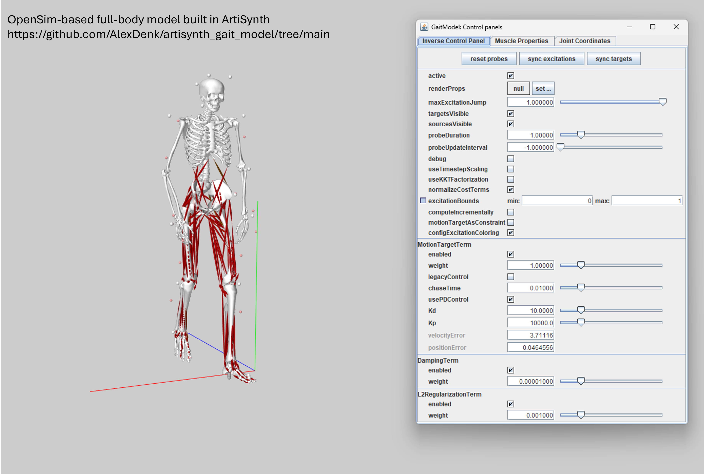

# OpenSim-based full-body multibody model built in Artisynth
This repository holds the current state of a full-body model based on the OpenSim model published by [Tim Dorn](https://simtk.org/frs/?group_id=433). The model was built using the freely available 3D modelling platform [ArtiSynth](https://www.artisynth.org/Main/HomePage). Additional artisynth models published by the developers can be found here: [artisynth_models](https://github.com/artisynth/artisynth_models). 

The model comes in two variations: including muscles (GaitModelWithMuscles) and excluding muscles (GaitModelWithoutMuscles). In the latter case, the model is purely driven by torques in the direction of each generalized coordinate (mostly joint angles), similar to the coordinate actuators used by OpenSim. The model is intended for combined multibody-finite element simulations subject to contact and constraint definitions. It contains muscles and a tracking controller, that solves for muscle activations based on experimental marker trajectories and ground reaction forces. As this project and research progresses we are continuously improving and updating this model and are open to suggestions for improvements and new potential applications.

If you use the model or parts of it in your research, please cite the following references:
> A. Denk, W. Kowalczyk. Lower Limb Multibody Model built in ArtiSynth for the Use in Coupled Multibody Finite Element Simulations. 95th Annual Meeting of the International Association of Applied Mathematics and Mechanics - GAMM, Poznan (Poland), April 07th - 11th 2025

> A. Denk, J. E. Lloyd, D. Raab, W. Kowalczyk. Developing and Validating an ArtiSynth Multibody Model for Gait Analysis. European Society of Biomechanics (ESB) Congress, ETH Zürich (Switzerland), July 06th - 09th 2025

The image shows the generated multibody model controlled by experimental marker trajectories and forces. Experimental forces are applied to the calcaneus. The inverse simulation solves for muscle activations, that lead to the observed movement. Tracking errors of the derived movements are in the range of 0.02 m.

## What this repository includes
* The Java class of this model
* Additional Java classes to read and process all related files
* The [Plug-in Gait model](https://simtk.org/frs/?group_id=433) using the Plug-in Gait full body markerset from Vicon Nexus and all necessary geometries.
* Two experimental datasets named plugingait01 and plugingait02 both containing experimental marker trajectories and ground reaction forces of one subject (m., 35 years, 70 kg).

## License
This source code is licensed under the license found in the [LICENSE file](LICENSE) in the root directory of this source tree.
