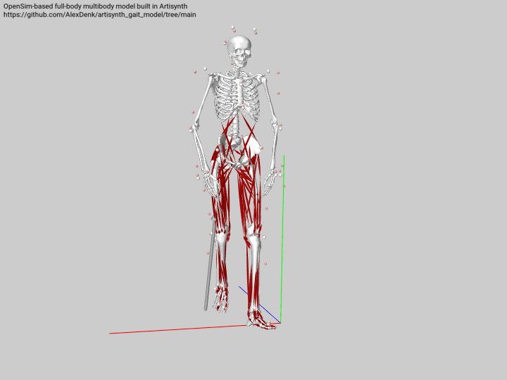

# OpenSim-based full-body multibody model built in Artisynth
This repository holds the current state of a full-body model based on the OpenSim model published by [Tim Dorn](https://simtk.org/frs/?group_id=433). The model was built using the freely available 3D modelling platform [ArtiSynth](https://www.artisynth.org/Main/HomePage). Additional artisynth models published by the developers can be found here: [artisynth_models](https://github.com/artisynth/artisynth_models). 

The model is intended for combined multi-body and finite element simulations and contains contact and constraint definitions.

If you use the model or parts of it in your research, please cite the following reference:
> Denk A., Kowalczyk W., Lower limb multibody model built in ArtiSynth for the use of coupled multibody-finite element simulations, in Book of Abstracts of the 95th Annual Meeting of the Association of Applied Mathematics and Mechanics, April 7th – April 11th, 2025 Poznan (Poland), pp. 74-75.

The image shows the generated multibody model controlled by Inverse Kinematics. Notice, that the ground-pelvis joint was removed in this model, since it is unnecessary in Artisynth. Ground reaction forces are available, but incorporation is still under development.

## What this repository includes
* The [gait2392 model](src/artisynth/models/diss) and all necessary geometries.
* A modified version of the gait2392 model including upper extremities and using the Plug-in Gait full body markerset from Vicon Nexus.
* The packages to read and process .mot files including an updated TRC-Reader
* Exemplary motion-capturing data from tutorial 1 of the [gait2392](https://simtk.org/frs/?group_id=91) model (Delp, S.L., Anderson, F.C., Arnold, A.S., Loan, P., Habib, A., John, C.T., Guendelman, E., Thelen, D.G. OpenSim: Open-source software to create and analyze dynamic simulations of movement. IEEE Transactions on Biomedical Engineering, 54(11), pp 1940-1950. (2007)).

## License
This source code is licensed under the license found in the [LICENSE file](LICENSE) in the root directory of this source tree.
